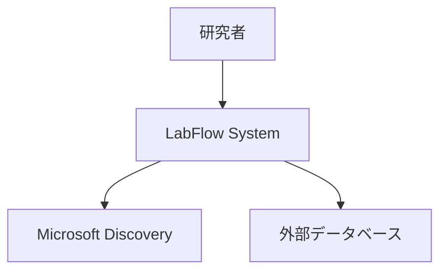
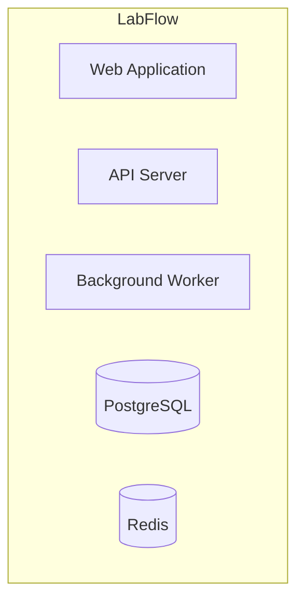
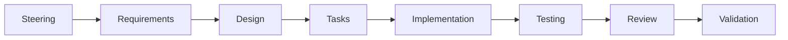
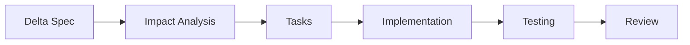

# MUSUBI SDD Workflow ガイド

**Project**: LabFlow
**Last Updated**: 2025-12-13
**Version**: 1.0
**Reference**: AGENTS.md

---

## Overview

MUSUBI (Ultimate Specification Driven Development) は、仕様駆動開発のためのフレームワークです。本ドキュメントでは、LabFlowプロジェクトで使用する8段階SDDワークフローの詳細手順を定義します。

---

## 8段階 SDDワークフロー

```
┌─────────────────────────────────────────────────────────────────────┐
│                         SDD Workflow                                 │
├─────────────────────────────────────────────────────────────────────┤
│                                                                      │
│  ┌──────────┐   ┌──────────┐   ┌──────────┐   ┌──────────┐         │
│  │ 1.Steer  │ → │ 2.Require│ → │ 3.Design │ → │ 4.Tasks  │         │
│  │ プロジェクト │   │ 要件定義  │   │ 設計     │   │ タスク分解│         │
│  └──────────┘   └──────────┘   └──────────┘   └──────────┘         │
│       ↓                                              ↓              │
│  ┌──────────┐   ┌──────────┐   ┌──────────┐   ┌──────────┐         │
│  │ 8.Valid  │ ← │ 7.Review │ ← │ 6.Test   │ ← │ 5.Impl   │         │
│  │ 検証     │   │ レビュー  │   │ テスト   │   │ 実装     │         │
│  └──────────┘   └──────────┘   └──────────┘   └──────────┘         │
│                                                                      │
└─────────────────────────────────────────────────────────────────────┘
```

---

## Stage 1: Steering（プロジェクトメモリ管理）

### 目的
プロジェクトのコンテキストを維持・更新する

### Prompt
```
#sdd-steering
```

### 入力
- ユーザーからの指示・質問
- 既存のsteeringファイル

### 出力
以下のファイルを更新:
- `steering/product.ja.md` - プロダクトコンテキスト
- `steering/structure.ja.md` - アーキテクチャパターン
- `steering/tech.ja.md` - 技術スタック
- `steering/rules/constitution.md` - 憲法（不変）

### チェックポイント
- [ ] ビジョン・ミッションが明確に定義されている
- [ ] ターゲットユーザーが具体的に記述されている
- [ ] 技術スタックが決定されている
- [ ] アーキテクチャパターンが定義されている

### 成果物の場所
```
steering/
├── product.ja.md       # プロダクトコンテキスト
├── structure.ja.md     # アーキテクチャ
├── tech.ja.md          # 技術スタック
├── project.yml         # プロジェクト設定
└── rules/
    ├── constitution.md # 憲法（9条）
    ├── ears-format.md  # EARS形式ガイド
    └── workflow.md     # このファイル
```

---

## Stage 2: Requirements（要件定義）

### 目的
EARS形式で機能要件を定義する

### Prompt
```
#sdd-requirements <feature>
```

### 入力
- 機能名/フィーチャー名
- プロダクトコンテキスト（product.ja.md）
- 既存の要件定義書

### 出力
- EARS形式の要件定義書

### チェックポイント
- [ ] 全要件がEARS形式（5パターンのいずれか）に従っている
- [ ] 要件IDが体系的に付与されている
- [ ] 優先度（P0-P3）が設定されている
- [ ] 検証方法が明記されている
- [ ] あいまいな表現がない

### 成果物の場所
```
storage/
├── specs/
│   └── [project]_requirements.md   # 要件定義書
└── features/
    └── [feature].md                # 機能別仕様
```

### EARS形式リファレンス
詳細は `steering/rules/ears-format.md` を参照

---

## Stage 3: Design（設計）

### 目的
要件から設計を導出する

### Prompt
```
#sdd-design <feature>
```

### 入力
- 要件定義書
- 技術スタック（tech.ja.md）
- アーキテクチャパターン（structure.ja.md）

### 出力
- C4モデル図（Context、Container、Component）
- ADR（Architecture Decision Records）
- API設計（OpenAPI仕様）
- データベーススキーマ
- トレーサビリティマトリクス

### チェックポイント
- [ ] C4モデルが作成されている
- [ ] 重要な設計決定がADRとして記録されている
- [ ] API設計がOpenAPI仕様に準拠している
- [ ] データベーススキーマが定義されている
- [ ] 要件IDと設計のマッピングが完了している（Article V）

### 成果物の場所
```
storage/
└── specs/
    ├── [project]_design.md         # 設計仕様書
    └── adr/
        └── ADR-XXX.md              # 設計決定記録
docs/
└── api/
    └── openapi.yaml                # API仕様
```

### C4モデルテンプレート

#### Level 1: System Context


#### Level 2: Container


---

## Stage 4: Tasks（タスク分解）

### 目的
設計を実装タスクに分解する

### Prompt
```
#sdd-tasks <feature>
```

### 入力
- 設計仕様書
- 要件定義書

### 出力
- タスクリスト（優先順位付き）
- タスク間の依存関係
- 見積もり時間
- 要件ID→タスクIDのマッピング

### チェックポイント
- [ ] タスクが十分に小さい（1日以内で完了可能）
- [ ] 依存関係が明確
- [ ] 各タスクにテストタスクが含まれている（Article III）
- [ ] 要件との紐付けが完了している（Article V）

### 成果物の場所
```
storage/
└── specs/
    └── [project]_tasks.md          # タスク分解書
```

### タスクテンプレート
```markdown
## Task: [TASK-XXX] タスク名

**関連要件**: DASH-MAIN-001, DASH-MAIN-002
**推定時間**: 4h
**依存タスク**: TASK-001, TASK-002
**担当**: TBD

### 説明
[タスクの詳細説明]

### 受け入れ条件
- [ ] 条件1
- [ ] 条件2

### テスト要件
- [ ] 単体テストが追加されている
- [ ] 統合テストが追加されている
```

---

## Stage 5: Implementation（実装）

### 目的
タスクを実装する

### Prompt
```
#sdd-implement <feature>
```

### 入力
- タスクリスト
- 設計仕様書
- 技術スタック

### 出力
- ソースコード
- テストコード
- ドキュメント更新

### チェックポイント
- [ ] Article I: Library-First に従っている
- [ ] Article II: CLI Interface が実装されている
- [ ] Article III: Test-First で実装されている
- [ ] コードスタイルガイドに準拠している
- [ ] ドキュメントが更新されている

### 成果物の場所
```
packages/
├── core/           # コアライブラリ（Article I）
│   └── [feature]/
├── cli/            # CLIツール（Article II）
└── web/            # Webアプリケーション
tests/
├── unit/           # 単体テスト
├── integration/    # 統合テスト
└── e2e/            # E2Eテスト
```

### Article I: Library-First パターン

すべての機能は以下のパターンで実装:

```
packages/core/[feature]/
├── src/
│   ├── domain/           # ドメインモデル
│   ├── application/      # ユースケース
│   ├── infrastructure/   # 外部連携
│   └── index.ts          # Public API
├── tests/
│   ├── unit/
│   └── integration/
├── package.json
└── README.md
```

---

## Stage 6: Testing（テスト）

### 目的
実装をテストで検証する

### 入力
- ソースコード
- 要件定義書（テスト要件）
- 設計仕様書

### 出力
- テスト結果レポート
- カバレッジレポート
- 不具合レポート

### チェックポイント
- [ ] カバレッジ80%以上（Article III）
- [ ] 全EARS要件にテストが存在する
- [ ] 統合テストが実際のサービスを使用している（Article IX）
- [ ] E2Eテストが主要ワークフローをカバーしている

### テストピラミッド

```
        /\
       /E2E\           少数・高コスト
      /─────\
     /Integration\     中程度
    /─────────────\
   /    Unit Tests   \  多数・低コスト
  /───────────────────\
```

### コマンド例
```bash
# 単体テスト
pnpm test:unit

# 統合テスト
pnpm test:integration

# E2Eテスト
pnpm test:e2e

# カバレッジ
pnpm test:coverage
```

---

## Stage 7: Review（レビュー）

### 目的
コードと仕様の整合性をレビューする

### 入力
- Pull Request
- 要件定義書
- 設計仕様書
- テスト結果

### 出力
- レビューコメント
- 承認/却下

### チェックポイント

#### コードレビュー
- [ ] コードスタイルガイドに準拠
- [ ] 適切なエラーハンドリング
- [ ] セキュリティ上の問題がない
- [ ] パフォーマンス上の問題がない

#### トレーサビリティレビュー（Article V）
- [ ] 要件IDがコミットメッセージに含まれている
- [ ] テストが要件をカバーしている
- [ ] 設計決定が文書化されている

---

## Stage 8: Validation（検証）

### 目的
Constitutional compliance を検証する

### Prompt
```
#sdd-validate <feature>
```

### 入力
- 完成した機能
- 9条の憲法

### 出力
- 検証レポート
- コンプライアンスステータス

### 9条検証チェックリスト

| Article | 内容 | 検証項目 |
|---------|------|---------|
| I | Library-First | `/lib` または `/packages/core` に実装されている |
| II | CLI Interface | CLIコマンドが存在する |
| III | Test-First | テストカバレッジ80%以上 |
| IV | EARS Format | 要件がEARS形式 |
| V | Traceability | 要件↔設計↔コード↔テストの紐付け |
| VI | Project Memory | steeringファイルが更新されている |
| VII | Greenfield | Greenfieldフローに従っている |
| VIII | Brownfield | 変更仕様が存在する（変更の場合） |
| IX | Integration-First | 統合テストが実サービスを使用 |

### 成果物の場所
```
storage/
└── validation/
    └── [feature]_validation_report.md
```

---

## ワークフローの選択

### Greenfield（新規開発）



フルサイクルを実行

### Brownfield（既存変更）



変更仕様（Delta Spec）から開始

---

## Prompt リファレンス

| Prompt | 説明 | Stage |
|--------|------|-------|
| `#sdd-steering` | プロジェクトメモリの更新 | 1 |
| `#sdd-requirements <feature>` | EARS要件の作成 | 2 |
| `#sdd-design <feature>` | C4モデル＋ADR設計 | 3 |
| `#sdd-tasks <feature>` | タスク分解 | 4 |
| `#sdd-implement <feature>` | 実装実行 | 5 |
| `#sdd-validate <feature>` | Constitutional検証 | 8 |

---

## ディレクトリ構造サマリー

```
LabFlow/
├── steering/                    # Stage 1: Project Memory
│   ├── product.ja.md
│   ├── structure.ja.md
│   ├── tech.ja.md
│   └── rules/
│       ├── constitution.md
│       ├── ears-format.md
│       └── workflow.md
├── storage/                     # Stage 2-4, 8: Artifacts
│   ├── specs/
│   │   ├── *_requirements.md    # Stage 2
│   │   ├── *_design.md          # Stage 3
│   │   └── *_tasks.md           # Stage 4
│   ├── features/
│   │   └── [feature].md
│   ├── changes/                  # Brownfield Delta Specs
│   └── validation/               # Stage 8
├── packages/                     # Stage 5: Implementation
│   ├── core/
│   ├── cli/
│   └── web/
├── tests/                        # Stage 6: Testing
│   ├── unit/
│   ├── integration/
│   └── e2e/
├── docs/                         # Documentation
│   └── api/
│       └── openapi.yaml
└── templates/                    # Templates
```

---

## 参考資料

1. **Constitution**: `steering/rules/constitution.md`
2. **EARS Format**: `steering/rules/ears-format.md`
3. **AGENTS.md**: プロジェクトルート

---

**Last Updated**: 2025-12-13
**Maintained By**: LabFlow Product Team
